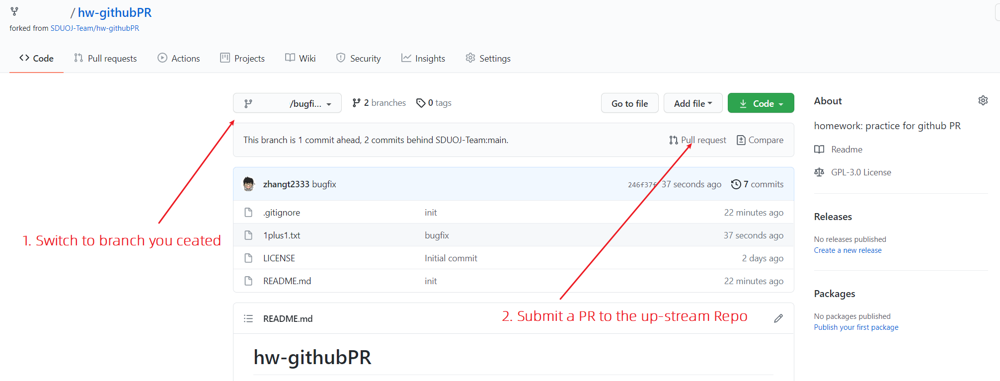
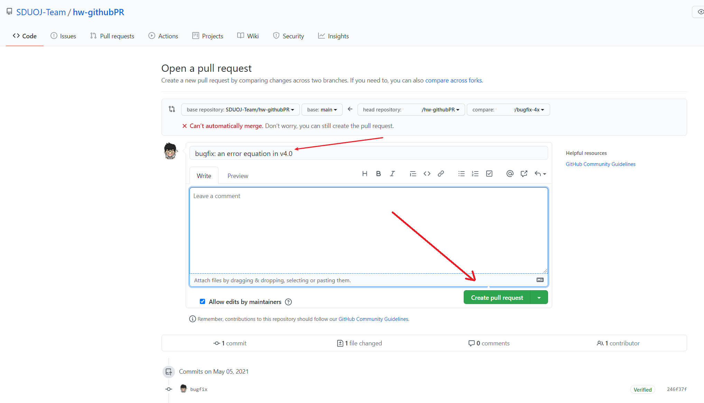

# hw-githubPR
homework: practice for github PR

### 前置知识
实践本 homework 之前：
* 请先完成 [hw-githubForkAndIssue](https://github.com/SDUOJ-Team/hw-githubForkAndIssue)。
* 请先完成 [hw-gitBranchAndCommit](https://github.com/SDUOJ-Team/hw-gitBranchAndCommit)。

### 本次 HW
本次 homework 是一些关于 `Git&Github` 的知识，在此，你将通过实践逐步学习以下知识：

1. Git log 查看
2. Git Checkout
3. Github PR

### 开始之前

1. Fork 当前 Repo 到你的账户之下，从现在开始这个 fork 出来的 Repo 将在下文中被称为 "你的 Repo"
2. 执行 `git clone https://github.com/你的用户名/hw-githubPR` 将你 fork 的仓库 clone 到本地


## hw1

步骤：
1. 在命令行中进入你的 Repo 的路径
2. 使用你觉得方便的方式查看这个 Repo 的 log，比如 "JetBrains IDE 的 VCS" 或 "[Git-Fork](https://git-fork.com/)" 等图形化应用，了解 log 图形大致如下： 
    ```
        v2.0---v3.0---v4.0---...--- master 
    ```
3. 你现在知道 v4.0 上有个 bug 需要去修，现在你需要基于 v4.0 这个 commit 创建一个新的 branch，命名为 `你的用户名/bugfix-4x`
    ```
                         你的用户名/bugfix-4x
                         /
        v2.0---v3.0---v4.0---...--- master 
    ```
4. 请修复 `1plus1.txt` 文件中第 4 行中存在的 bug，并且提交一个 commit，然后 push
5. 随后在你的 Repo 里操作，提交一个 PR 到母仓库

